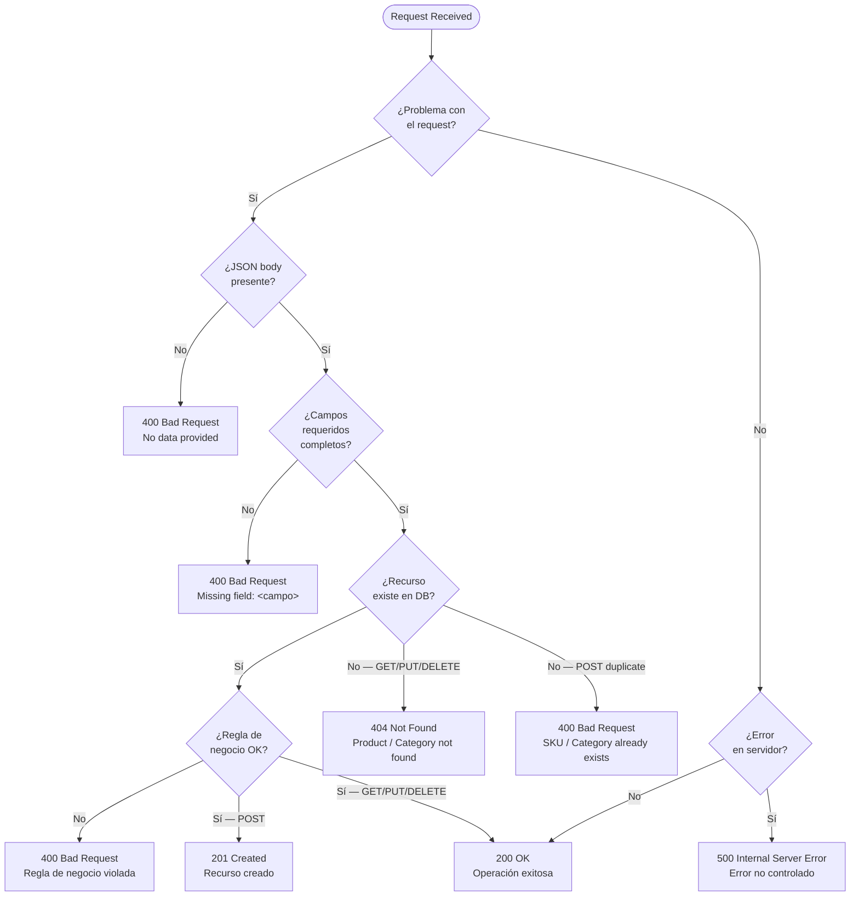
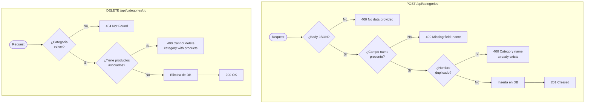
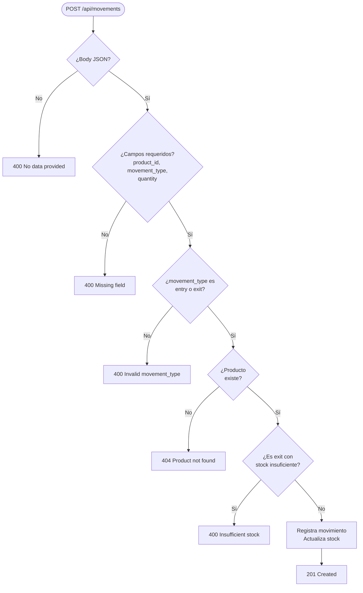

# Flujo de Códigos de Respuesta HTTP — Flask Inventory API

Diagrama de decisión que muestra cómo la API determina el código de respuesta HTTP para cada request, basado en la lógica real de los endpoints.

---

## Diagrama General

---

## Reglas de Negocio que Devuelven 400

Cada endpoint tiene validaciones específicas adicionales más allá de los campos requeridos:

| Endpoint | Condición | Mensaje de error |
|---|---|---|
| `POST /api/products` | SKU ya registrado | `SKU already exists` |
| `PUT /api/products/<id>` | Nuevo SKU ya pertenece a otro producto | `SKU already exists` |
| `POST /api/categories` | Nombre de categoría ya registrado | `Category name already exists` |
| `PUT /api/categories/<id>` | Nuevo nombre ya pertenece a otra categoría | `Category name already exists` |
| `DELETE /api/categories/<id>` | Categoría tiene productos asociados | `Cannot delete category with associated products` |
| `POST /api/movements` | `movement_type` no es `entry` ni `exit` | `Invalid movement_type. Must be "entry" or "exit"` |
| `POST /api/movements` | Tipo `exit` con stock insuficiente | `Insufficient stock. Current stock: <n>` |

---

## Flujo por Endpoint

### Products `/api/products`

```mermaid
flowchart TD
    subgraph GET_ALL["GET /api/products"]
        G1([Request]) --> G2[Consulta todos\nlos productos] --> G3[200 OK\nArray JSON]
    end

    subgraph POST["POST /api/products"]
        P1([Request]) --> P2{¿Body JSON?}
        P2 -->|No| P3[400 No data provided]
        P2 -->|Sí| P4{¿Campos requeridos?\nsku, name, price,\nstock, min_stock}
        P4 -->|No| P5[400 Missing field]
        P4 -->|Sí| P6{¿SKU\nduplicado?}
        P6 -->|Sí| P7[400 SKU already exists]
        P6 -->|No| P8[Inserta en DB] --> P9[201 Created]
    end

    subgraph GET_ONE["GET /api/products/:id"]
        G4([Request]) --> G5{¿Producto\nexiste?}
        G5 -->|No| G6[404 Not Found]
        G5 -->|Sí| G7[200 OK\nObjeto JSON]
    end

    subgraph PUT["PUT /api/products/:id"]
        U1([Request]) --> U2{¿Producto\nexiste?}
        U2 -->|No| U3[404 Not Found]
        U2 -->|Sí| U4{¿Body JSON?}
        U4 -->|No| U5[400 No data provided]
        U4 -->|Sí| U6{¿SKU nuevo\nduplicado?}
        U6 -->|Sí| U7[400 SKU already exists]
        U6 -->|No| U8[Actualiza en DB] --> U9[200 OK]
    end

    subgraph DELETE["DELETE /api/products/:id"]
        D1([Request]) --> D2{¿Producto\nexiste?}
        D2 -->|No| D3[404 Not Found]
        D2 -->|Sí| D4[Elimina de DB] --> D5[200 OK\nProduct deleted]
    end
```

---

### Categories `/api/categories`

---

### Movements `/api/movements`

---

## Resumen de Códigos

| Código | Descripción | Cuándo ocurre en esta API |
|---|---|---|
| **200 OK** | Éxito | GET (todos o por ID), PUT, DELETE exitoso |
| **201 Created** | Recurso creado | POST exitoso en products, categories, movements |
| **400 Bad Request** | Error del cliente | Body ausente, campo faltante, duplicado, regla de negocio violada |
| **404 Not Found** | Recurso no encontrado | ID inexistente en products, categories o movements |
| **500 Internal Server Error** | Error del servidor | Excepción no controlada (BD caída, error inesperado) |
